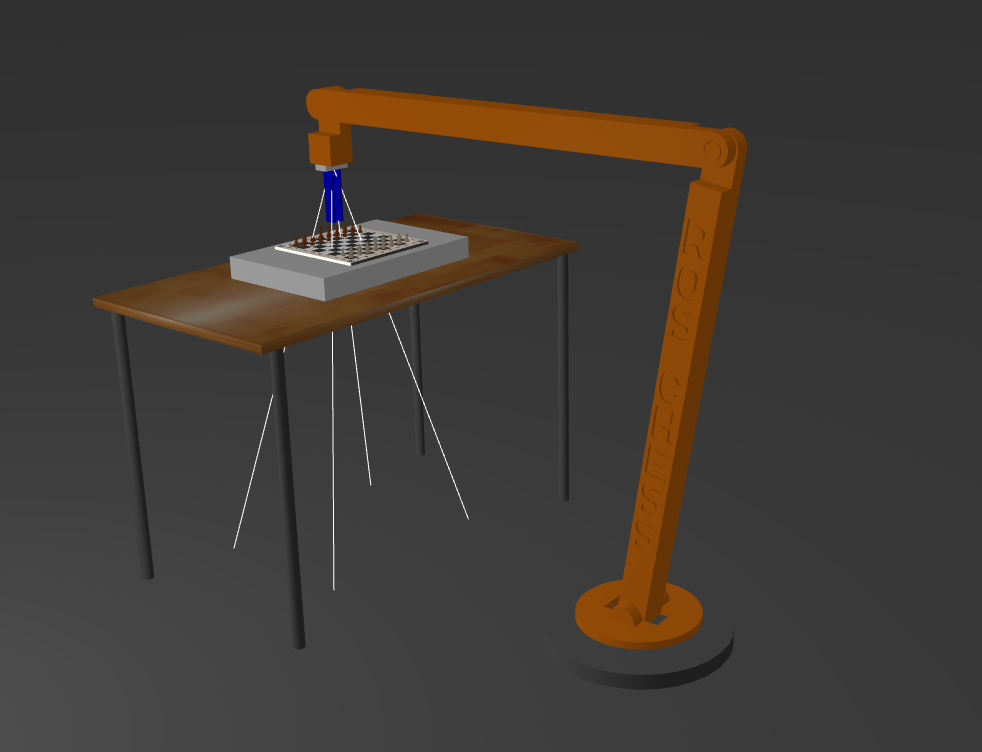
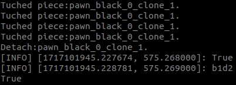
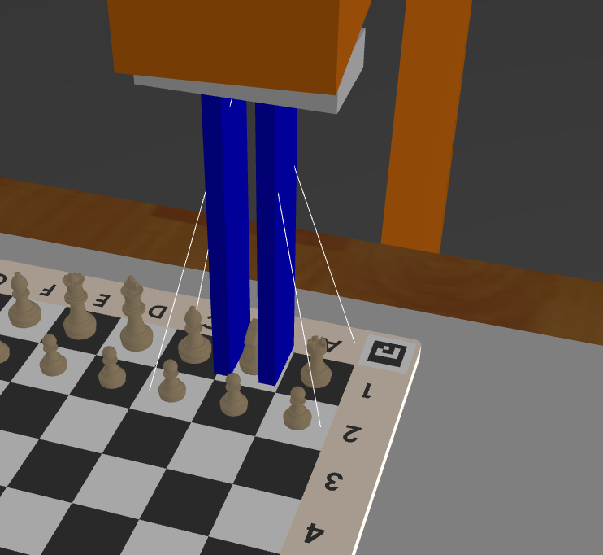
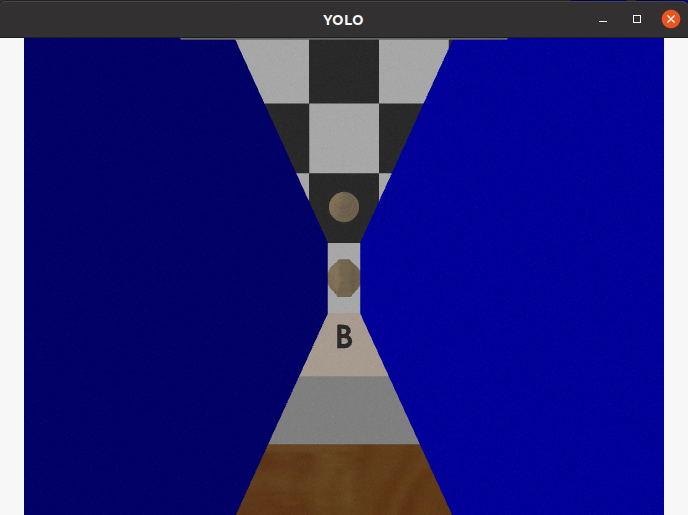
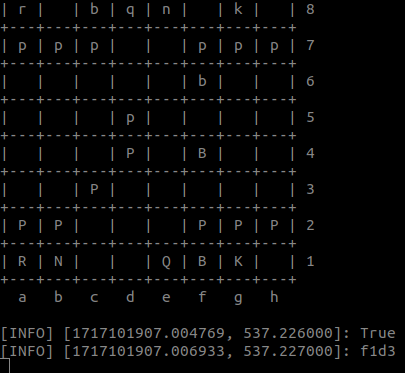
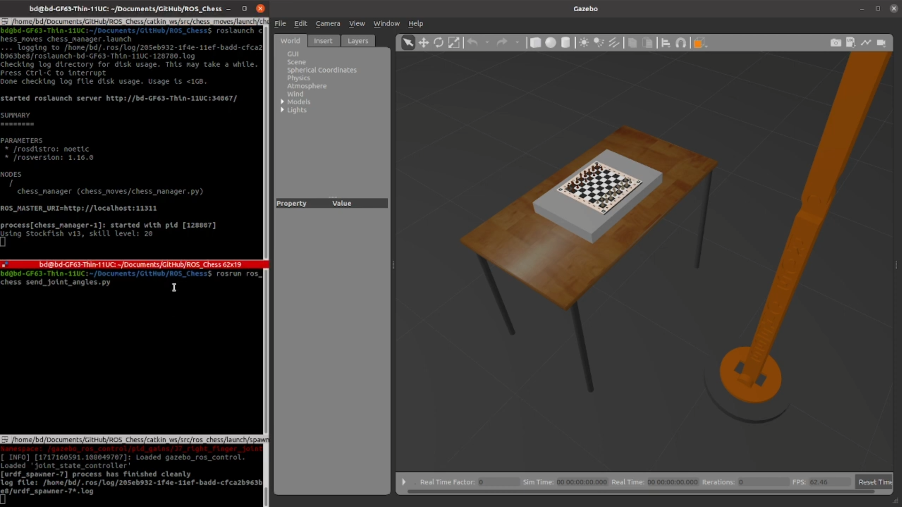
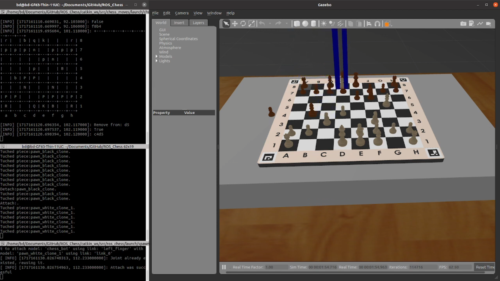

# ROS_Chess

# Bevezetés

A projekt célja egy sakkozó robot tervezése és megvalósítása, amely képes önállóan játszani a sakkot akár egy emberi játékos ellen. A robotnak képesnek kell lennie a bábukat mozgatni, lépéseket szimulálni, és kamerarendszer segítségével felismerni a különböző sakkbábukat. A projekt során a Robot Operating System (ROS) keretrendszert használjuk a robot irányítására és az egyes alrendszerek integrációjára, a modellek és annak környezetének szimulációjához pedig a Gazebot.

# Rendszerkövetelmények

- Robotkar: Pontos és precíz mozgásra képes, legalább 6 szabadságfokú robotkar.
- Kamera: Színes kamera a sakkbábuk és azok mozgás közben felismeréséhez.
- Bábumozgatás: A robotkar képes legyen a sakktábla minden mezejére elérni és precízen megfogni, mozgatni a sakkbábukat.

# Szükséges csomagok

## A projektünkhöz szükséges volt az alábbi csomagok telepítése:

- ros-noetic-desktop-full
- python3-roslaunch
- ros-noetic-rqt-multiplot
- gazebo11
- ros-noetic-hector-trajectory-server
- joint-trajectory-controller
- moveit
- stockfish

# Modellezés

Modellezés során először megterveztük a robotkarunkat SolidEdge segítségével, utána konvertáltuk át a számunka szükséges SDF fájlokra. A sakktábla és sakkbábuk paraméterezése során Xacro fájlt használtuk. Végül a kameránkat (```camera_link```) először a robotunk Xacro fájlához adtuk, utána a hozzá tartozó plugint a Gazebo fájlban helyeztük el.



# Futtatás
1. ROS_Chess git projekten belül carkin_ws megnyitása terminálon belül ezt érdemes minden új terminál ablaknál megtenni. Git alapértelmezett beállítás esetén: 
```console
cd ~/Documents/GitHub/ROS_Chess/catkin_ws
```
2. Minden terminál ablakon belül be kell tölteni a projectet (ha valami nem működik akkor valószínűleg ennek a lépésnek a hiánya okozza):
```console
source devel/setup.bash
```
3. Környezet és vezérlő indítása
3.1. Robot szimuláció, Gazebo környezet, Rosmaster indítása és vezérlő paramétereinek előkészítése 
```console
roslaunch ros_chess spawn_robot.launch
```
3.2. Robot vezérlő indítása 
```console
rosrun rqt_joint_trajectory_controller rqt_joint_trajectory_controller
```
3.3. Kamera YOLO indítása
```console
roslaunch darknet_ros darknet_ros.launch
```
4. Fontosabb egyéb program:
4.1. PID hangoláshoz:
```console
rosrun rqt_reconfigure rqt_reconfigure
```
4.2. rqt minden máshoz (rosmaster-nek futnia kell):
```console
rqt
```

# Inverz kinematika

Az inverz kinematika során meghatározzuk a robotkar egyes ízületeinek szögeit annak érdekében, hogy a robotkar végpontja (end-effector) elérjen egy kívánt pozíciót és orientációt. Ez különösen fontos volt a sakkozó robotunknál, ahol a robotkarnak pontosan kellett mozgatnia a sakkbábunkat a sakktáblán. A mozgást úgy oldottuk meg, hogy a robotunknak csak a ... részei vesznek részt a mozgásban.



# Kamera bábufelismerő YOLO segítségével

A sakkbábuk felismeréséhez a YOLO (You Only Look Once) valós idejű objektum felismerő algoritmust használtuk, amelyet a Darknet keretrendszerben implementáltak. Ez az algoritmus hatékony és gyors objektumdetektálást tesz lehetővé, amely különösen alkalmas valós idejű alkalmazásokra, ami tökéletes a robot projektünkhöz. A képet rácsokra osztja feldolgozás során, ahol minden rács felelős az objektumok detektálásáért és lokalizálásáért.




# Sakkozó stockfish AI

A Stockfish egy nyílt forráskódú sakkmotor, amely az egyik legerősebb sakk AI a világon. A rendszerünk lehetővé teszi, hogy a robotkar vezérelje a sakkbábukat a sakktáblán, miközben a Stockfish AI meghozza a játék döntéseit.



# Beágyazott videó a robot működéséről

## Robot mozgásának bemutatása
[](https://www.youtube.com/watch?v=CyoBn3Ph2eI)

## Sakktábla közeli bemutatása
[]([https://www.youtube.com/watch?v=CyoBn3Ph2eI](https://www.youtube.com/watch?v=Xaju2DYqLnQ))

# Konklúzió
A sakkozó robot tervezése és megvalósítása összetett mérnöki feladat, amely több terület (robotika, képfeldolgozás, mesterséges intelligencia) integrációját igényli. A ROS alapú megközelítés lehetőséget biztosít a rendszer moduláris fejlesztésére és skálázhatóságára. A projekt végére a robotunk képes önállóan és megbízhatóan sakkozni, kielégítve a fenti követelményeket és mérnöki elvárásokat.

